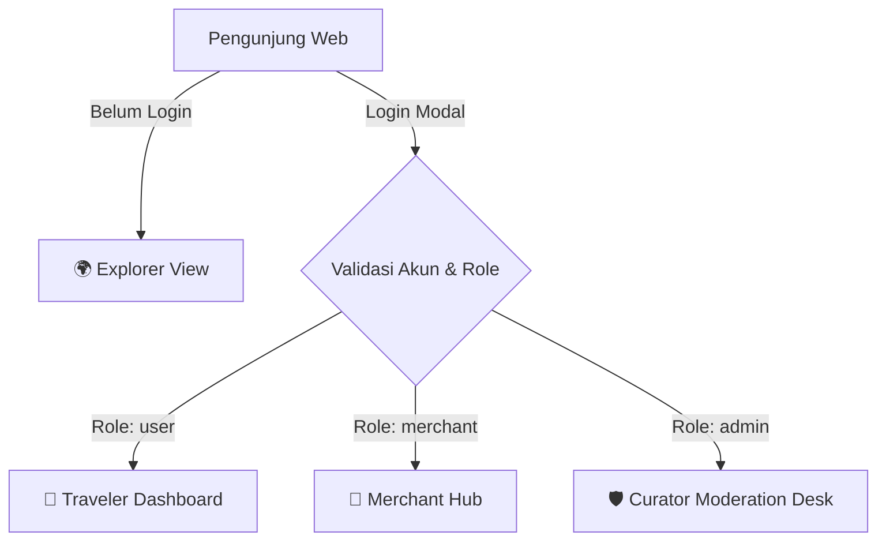

# ⚡ WEEKENDLY [Anti AI-Slop] &bull; KalaPekan

> **Aplikasi Rekomendasi Liburan Akhir Pekan Cerdas Berbasis Prakiraan Cuaca Real-Time, Verified POI Google Maps, Desain Neubrutalisme, dan Arsitektur Multi-Role RBAC.**

Proyek ini dibangun berdasarkan integrasi multi-API publik (*API Mashup*) yang dikurasi dari repositori [public-apis/public-apis](https://github.com/public-apis/public-apis).

---

## 🎨 Filosofi Desain: Neubrutalism (Anti AI-Slop)

Weekendly sengaja menolak gaya *"AI-slop"* generik (gradien ungu pastel kabur, glassmorphism buram, borderless card seragam) dan mengusung estetika **Neubrutalisme**:
* **High-Contrast Bold Borders:** Border hitam tegas (`border-[3px] border-black` dan `border-[4px] border-black`).
* **Tactile Hard Drop Shadows:** Bayangan solid tanpa blur (`shadow-[4px_4px_0px_#000]` dan `shadow-[8px_8px_0px_#000]`) yang memberikan sensasi fisik retro saat berinteraksi.
* **Punchy Color Palette:** Canary Yellow (`#FFE600`), Electric Lime (`#A3E635`), Retro Sky (`#38BDF8`), Hot Coral (`#FF6B6B`), dan Neon Purple (`#C084FC`).
* **Micro-Stickers & Monospace Typography:** Header tebal sans-serif dipadukan dengan aksen monospace (`font-mono`) untuk badge status dan koordinat.

---

## 🔐 Sistem Autentikasi & 4 Tampilan Berdasarkan Role (RBAC)

Aplikasi menerapkan sistem autentikasi ketat (**Strict Neubrutalist Auth Modal**) di mana setiap pengguna harus masuk dengan akun kredensial yang valid. Setiap role memiliki tampilan dasbor khusus:



### 1. 🌍 Explorer View (Guest / Publik)
* **Prakiraan Cuaca Real-Time:** Menampilkan kondisi cuaca Sabtu & Minggu (suhu, curah hujan, angin, index kenyamanan).
* **Katalog Destinasi:** Filter berdasarkan kategori (Indoor/Outdoor/Kafe/Budaya) dan status operasional.
* **Peta Interaktif:** Pin lokasi wisata dengan status buka/tutup dan preview rute.
* *Guarded:* Tindakan simpan wishlist atau submit review akan memunculkan modal login.

### 2. 🎒 Traveler Dashboard (Registered User)
* **Agenda Akhir Pekan (Wishlist):** Daftar tempat tersimpan lengkap dengan perkiraan cuaca Sabtu & Minggu.
* **Simulator Weekend Weather Alert:** Simulasi notifikasi otomatis setiap Jumat pukul 17:00 jika cuaca Sabtu diprediksi hujan lebat.
* **Riwayat Ulasan Komunitas:** Catatan review dan rekomendasi tempat yang telah dikunjungi.

### 3. 🏪 Merchant Hub (Pemilik Usaha / Mitra)
* **Portal Pendaftaran Destinasi:** Mendaftarkan venue baru (alamat, jam operasional, link Google Maps, fasilitas).
* **Manajemen Promo Weekend:** Menambahkan diskon khusus akhir pekan (misal: *Diskon 25% Boardgame Pass saat Hujan*).
* **Status Kurasi Transparan:** Melacak status tempat apakah masih `PENDING` atau sudah `APPROVED`.

### 4. 🛡️ Curator Moderation Desk (Platform Admin)
* **Panel Kurasi & Moderasi:** Melakukan verifikasi, menyetujui (*Approve*), atau menolak (*Reject*) tempat yang didaftarkan merchant.
* **Integrasi Otomatis:** Tempat yang disetujui langsung tampil di peta interaktif dan katalog publik.
* **User Directory & API Monitor:** Memantau ketersediaan endpoint Open-Meteo dan OpenStreetMap secara real-time.

---

## 🗺️ Verified Google Maps & OpenStreetMap Integration

Tidak ada data dummy atau halusinasi generik:
* **Real Landmark Data:** Seluruh tempat (seperti *Museum Geologi, Tahura Djuanda, Selasar Sunaryo, Saung Udjo, Tebet Eco Park, Museum Nasional, MoJA Art, Prambanan*, dll) menggunakan alamat fisik, jam operasional nyata, dan koordinat akurat.
* **Live Interactive Embeds:** Modal detail tempat dilengkapi iframe Google Maps live embed dan tombol langsung ke rute Google Maps.

---

## 🔌 Public API Terintegrasi

| Komponen | Sumber / Provider | Deskripsi & Autentikasi |
| :--- | :--- | :--- |
| **Prakiraan Cuaca** | [Open-Meteo API](https://open-meteo.com/) | Data presisi jam-jaman & harian, 100% Free, No API Key. |
| **Geocoding & Koordinat** | [Nominatim (OpenStreetMap)](https://nominatim.openstreetmap.org/) | Konversi nama kota ke Latitude/Longitude secara instan. |
| **Data POI / Destinasi** | [Overpass API (OSM)](https://overpass-api.de/) + Curated Database | Query objek wisata, taman, dan museum di sekitar titik. |
| **Peta Interaktif** | [Leaflet.js + OpenStreetMap Tiles](https://leafletjs.com/) | Client-side map rendering ringan dengan custom SVG neubrutalist pins. |

---

## 🚀 Cara Menjalankan

```bash
# 1. Pindah ke direktori proyek
cd "D:\Rizkia\Project Software\weekendly"

# 2. Pasang dependensi (jika belum)
npm install

# 3. Jalankan development server
npm run dev
```

Buka URL lokal yang muncul (biasanya `http://localhost:5173` atau `http://localhost:5175`) di browser favorit Anda.
